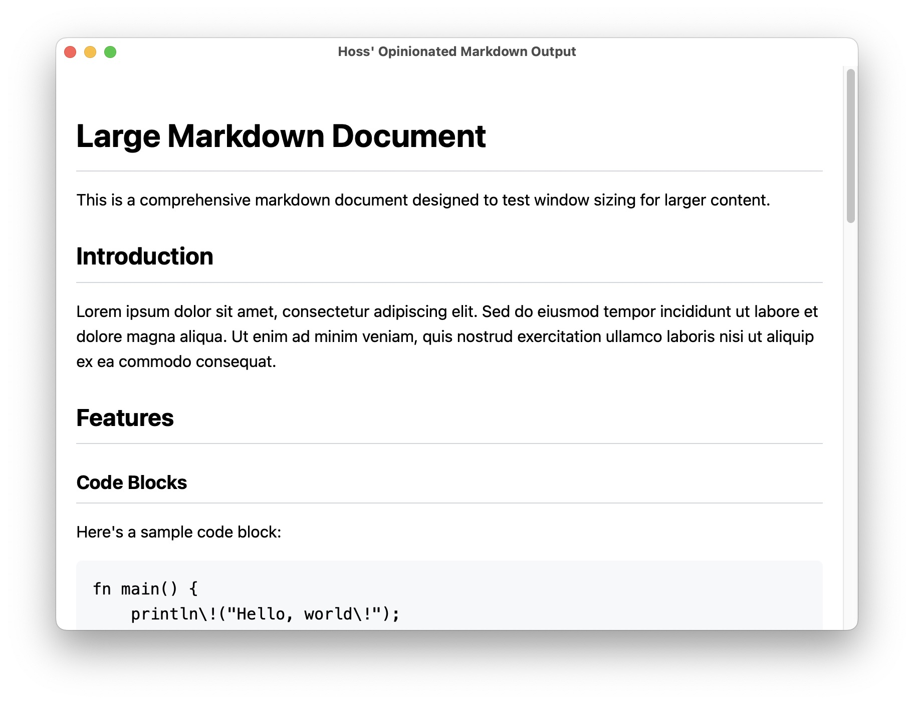

# HOMO: Hoss' Opinionated Markdown Output

A fast, native macOS Markdown viewer with streaming support. Pipe Markdown to it, open a file directly, or launch an empty window for quick previews. Built with [cacao](https://github.com/PistonDevelopers/cacao) and [pulldown-cmark](https://github.com/raphlinus/pulldown-cmark).

## Screenshot



---

## Features

- **Native macOS GUI** (AppKit/WebView)
- **Live streaming**: Pipe Markdown to stdin and see live updates
- **Open files directly**: Pass a markdown file as an argument to view it instantly
- **GitHub-flavored Markdown**: Tables, footnotes, strikethrough, task lists
- **Mermaid diagram support**: Interactive flowcharts, sequence diagrams, and more
- **LaTeX/Math rendering**: KaTeX support for mathematical expressions
- **External link handling**: Opens links in your browser
- **Customizable appearance**: Font family, size, and theme preferences

---

## Install

### Download Pre-built Binary (Recommended)

Download the latest release for your platform from the [releases page](https://github.com/CJHwong/rs-homo/releases):

- **macOS (Intel)**: `homo-macos-amd64`
- **macOS (Apple Silicon)**: `homo-macos-arm64`

Then make it executable and add to your PATH:

```sh
chmod +x homo-macos-arm64
sudo mv homo-macos-arm64 /usr/local/bin/homo
```

### Build from Source

#### Prerequisites

- Rust (latest stable, [install here](https://rustup.rs/))
- macOS 11+ (Apple Silicon or Intel)

#### Build & Install

```sh
# Clone the repo
$ git clone https://github.com/CJHwong/homo.git
$ cd homo

# Build the app
$ cargo build --release

# Optionally, install to your Cargo bin directory
$ cargo install --path .
```

---

## Usage

### Pipe Markdown to the app

```sh
echo '# Hello, world!' | homo
```

Or stream a file:

```sh
tail -f README.md | homo
```

### Open a Markdown file directly

```sh
homo README.md
```

---

## Development

### Project Structure

- `src/main.rs` — Entry point, handles GUI/streaming mode detection
- `src/gui/` — Complete GUI implementation using AppKit bindings
  - `delegate.rs` — App delegate handling window lifecycle and content updates
  - `view.rs` — WebView wrapper for rendering HTML with Mermaid support
  - `window.rs` — Window creation and management
  - `types.rs` — Style preferences and theme management
- `src/markdown/` — Markdown parsing with syntax highlighting
- `src/streaming.rs` — Intelligent streaming with boundary detection
- `src/content.rs` — DocumentContent struct for thread communication
- `src/menu.rs` — Menu system with preferences and actions
- `src/plugins/` — Plugin system for extensible content processing
  - `manager.rs` — Plugin registration and execution management
  - `mermaid.rs` — Mermaid diagram rendering plugin
  - `katex.rs` — LaTeX/math rendering plugin
- `src/error.rs` — Custom error types and handling

### Running Locally

```sh
cargo run
```

To test streaming mode:

```sh
echo '## Streaming test' | cargo run --
```

---

## User Preferences

HOMO stores user preferences (font size, font family, theme) in macOS UserDefaults. These preferences persist across app launches.

### Managing Preferences

View current preferences:

```bash
defaults read homo StylePreferences
```

Reset preferences to defaults:

```bash
defaults delete homo StylePreferences
```

### Available Preferences

- **Font Family**: System, Menlo, Monaco, Helvetica
- **Font Size**: Adjustable via keyboard shortcuts or menu
- **Theme**: Light, Dark, System (follows macOS appearance)

---

## Keyboard Shortcuts

### Font Size

- **⌘ + =** (or **⌘ + +**): Increase font size
- **⌘ + -**: Decrease font size  
- **⌘ + 0**: Reset font size to default

### Font Family

- **⌘ + 1**: System font
- **⌘ + 2**: Menlo font
- **⌘ + 3**: Monaco font
- **⌘ + 4**: Helvetica font

### Theme

- **⌘ + L**: Light theme
- **⌘ + D**: Dark theme
- **⌘ + S**: System theme (follows macOS appearance)

### View

- **⌘ + T**: Toggle mode (for displaying the raw Markdown)

### Standard macOS

- **⌘ + C**: Copy selected text
- **⌘ + A**: Select all text
- **⌘ + W**: Close window

---

## License

MIT
