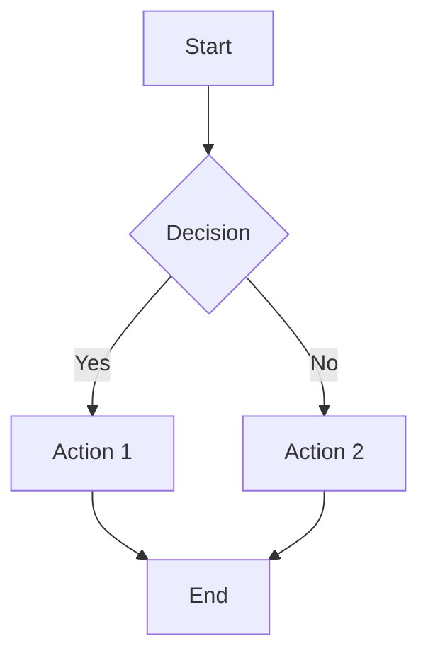
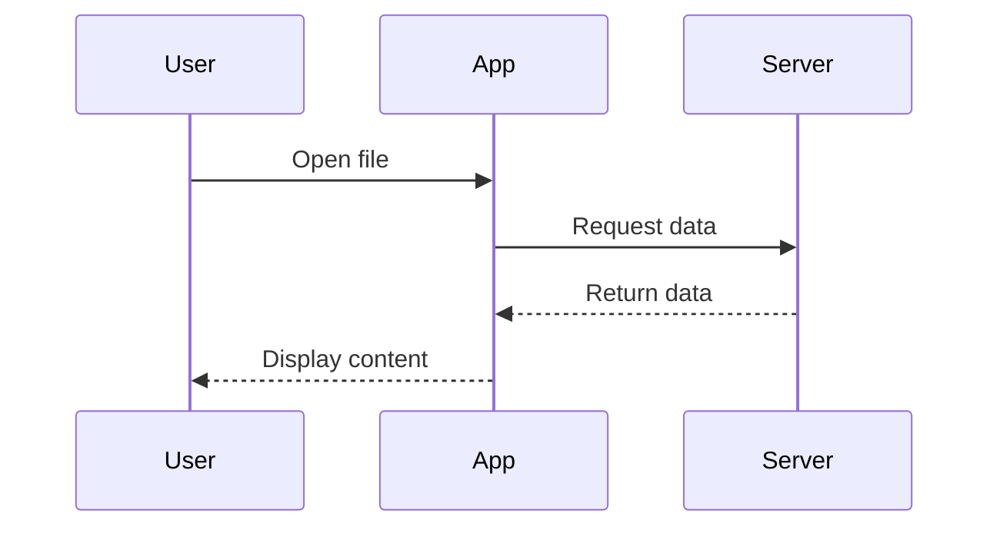
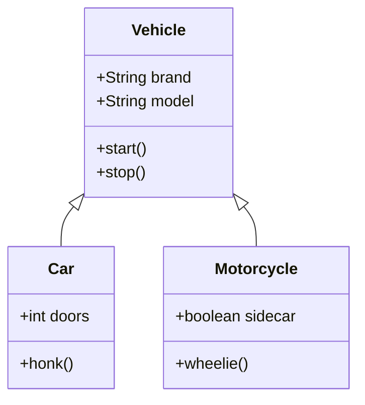
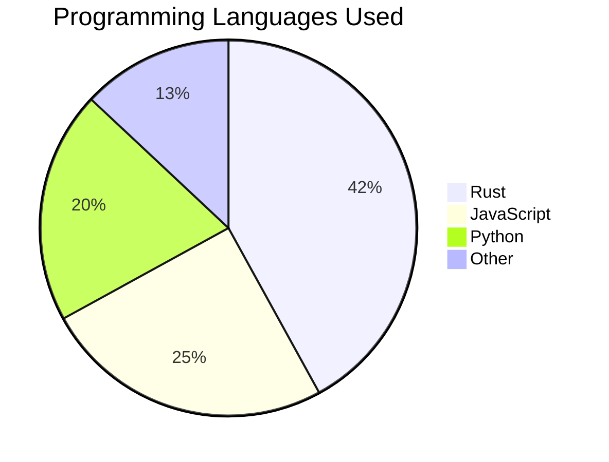
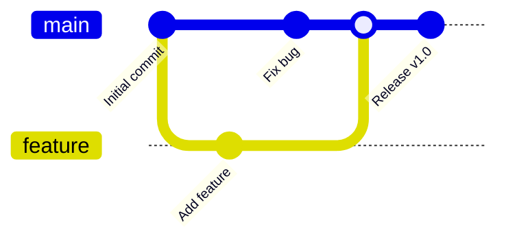

# Markdown Test Suite

This document tests all the markdown syntax supported by `pulldown-cmark`.

## Headers

# H1 Header

## H2 Header  

### H3 Header

#### H4 Header

##### H5 Header

###### H6 Header

Alternative H1
==============

Alternative H2
--------------

## Text Formatting

**Bold text** and **also bold**

*Italic text* and *also italic*

***Bold and italic*** and ***also bold and italic***

~~Strikethrough text~~

`Inline code` with backticks

## Lists

### Unordered Lists

- Item 1
- Item 2
  - Nested item 2.1
  - Nested item 2.2
    - Deep nested item
- Item 3

- Alternative bullet style
- Another item
  - Nested with asterisk

- Plus sign bullets
- Another plus item

### Ordered Lists

1. First item
2. Second item
   1. Nested numbered item
   2. Another nested item
3. Third item

1. Numbers don't have to be sequential
1. They can all be 1
1. And it still works

## Links and References

[Inline link](https://www.rust-lang.org)

[Link with title](https://www.rust-lang.org "Rust Programming Language")

[Reference link][rust]

[Another reference][1]

Autolink: <https://www.rust-lang.org>

Email autolink: <hello@rust-lang.org>

[rust]: https://www.rust-lang.org
[1]: https://doc.rust-lang.org/book/

## Images


![Reference image][image-ref]

[image-ref]: https://via.placeholder.com/100x100

## Code Blocks

### Inline Code

Here's some `inline code` in a sentence.

### Fenced Code Blocks

```
Plain code block without syntax highlighting
let x = 42;
println!("Hello, world!");
```

```rust
// Rust code with syntax highlighting
fn main() {
    let greeting = "Hello, world!";
    println!("{}", greeting);
    
    let numbers = vec![1, 2, 3, 4, 5];
    for num in numbers {
        println!("Number: {}", num);
    }
}
```

```javascript
// JavaScript example
function fibonacci(n) {
    if (n <= 1) return n;
    return fibonacci(n - 1) + fibonacci(n - 2);
}

console.log(fibonacci(10));
```

```python
# Python example
def quick_sort(arr):
    if len(arr) <= 1:
        return arr
    
    pivot = arr[len(arr) // 2]
    left = [x for x in arr if x < pivot]
    middle = [x for x in arr if x == pivot]
    right = [x for x in arr if x > pivot]
    
    return quick_sort(left) + middle + quick_sort(right)
```

### Indented Code Blocks

    This is an indented code block
    It preserves whitespace
    And treats everything as code

## Blockquotes

> This is a blockquote.
> It can span multiple lines.

> Blockquotes can be nested
> > Like this inner quote
> > > And even deeper

> You can use **markdown** inside blockquotes
>
> Including other elements:
>
> - Lists
> - `Code`
> - [Links](https://example.com)

## Tables

| Left Aligned | Center Aligned | Right Aligned |
|:-------------|:--------------:|--------------:|
| Left         | Center         | Right         |
| Text         | Text           | Text          |
| More content | More content   | More content  |

| Column 1 | Column 2 | Column 3 |
|----------|----------|----------|
| Row 1    | Data     | Values   |
| Row 2    | More     | Info     |

## Horizontal Rules

---

***

___

- - -

* * *

_ _ _

## Line Breaks and Paragraphs

This is a paragraph with a soft line break.
It continues on the same line when rendered.

This is a paragraph with a hard line break.  
Notice the two spaces at the end of the previous line.

This is a separate paragraph.

## Escape Characters

\*Not italic\* and \**not bold**

\# Not a header

\[Not a link\](not-a-url)

\`Not code\`

## HTML Elements (if supported)

<em>Emphasized text using HTML</em>

<strong>Strong text using HTML</strong>

<del>Deleted text</del>

<ins>Inserted text</ins>

<mark>Highlighted text</mark>

<sub>Subscript</sub> and <sup>Superscript</sup>

<kbd>Ctrl</kbd> + <kbd>C</kbd>

<!-- This is an HTML comment -->

## Task Lists (GitHub Extension)

- [x] Completed task
- [ ] Incomplete task
- [x] Another completed task
  - [x] Nested completed task
  - [ ] Nested incomplete task

## Definition Lists

Term 1
:   Definition 1

Term 2
:   Definition 2a
:   Definition 2b

## Footnotes

Here's a sentence with a footnote[^1].

Another sentence with a footnote[^note].

[^1]: This is the first footnote.
[^note]: This is a named footnote with more content.

    It can contain multiple paragraphs and code:

    ```
    Code in footnote
    ```

## Mermaid Diagrams

### Flowchart



### Sequence Diagram



### Class Diagram



### Pie Chart



### Git Graph



## Complex Combinations

### Nested Lists with Code

1. First item with code: `let x = 42;`
2. Second item with a nested list:
   - Subitem with **bold text**
   - Another subitem with a [link](https://example.com)

   ```rust
   // Code block in a list item
   fn hello() {
       println!("Hello from a list!");
   }
   ```

3. Third item with a blockquote:
   > This is a quote inside a list item.
   > It can span multiple lines.

### Table with Complex Content

| Feature | Description | Example |
|---------|-------------|---------|
| **Bold** | Bold text | `**text**` |
| *Italic* | Italic text | `*text*` |
| `Code` | Inline code | `` `code` `` |
| [Link](https://example.com) | Hyperlink | `[text](url)` |

## Edge Cases

### Empty Elements

-
  
  Empty list item with content below

1.

   Empty numbered item

### Multiple Emphasis

***This is bold and italic***

**This is just bold with *italic inside***

*This is italic with **bold inside***

### Code with Backticks

To display `` `code` `` with backticks, use multiple backticks.

### Long Lines

This is a very long line that should wrap properly in the markdown viewer and demonstrate how the application handles text wrapping and line breaks in different viewport sizes and window configurations.

### Unicode and Special Characters

Emoji: 🦀 🔥 ⚡ 🚀 💻 📝

Symbols: © ® ™ § ¶ † ‡ • … ‰ ′ ″ ‴ ※

Math: α β γ δ ε ζ η θ ι κ λ μ ν ξ ο π ρ σ τ υ φ χ ψ ω

Arrows: ← → ↑ ↓ ↔ ↕ ↖ ↗ ↘ ↙

## Testing Markdown Parsing Edge Cases

### Ambiguous Emphasis

*italic* text and *more italic*

**bold** text and **more bold**

word*italic*word

word**bold**word

### Complex Nested Structures

> ### Header in blockquote
>
> 1. Ordered list in blockquote
> 2. With `inline code`
>
>    ```rust
>    // Code block in blockquote list
>    fn nested() {
>        println!("Very nested!");
>    }
>    ```
>
> 3. Third item
>
> | Table | In | Blockquote |
> |-------|----|-----------|
> | Cell  | Cell | Cell    |

### Raw HTML Mixed with Markdown

<div>
<p>This is <strong>HTML</strong> mixed with *markdown*.</p>
<ul>
  <li>HTML list with **markdown bold**</li>
  <li>Another item with `inline code`</li>
</ul>
</div>

## LaTeX Mathematical Expressions

### Basic Mathematics

Simple equation using `math` language:

```math
E = mc^2
```

### Quadratic Formula

Using `latex` language for more complex expressions:

```latex
x = \frac{-b \pm \sqrt{b^2 - 4ac}}{2a}
```

### Calculus

Integration example using `tex` language:

```tex
\int_0^1 x^2 \, dx = \frac{1}{3}
```

### Advanced Mathematics

Summation notation:

```math
\sum_{n=1}^{\infty} \frac{1}{n^2} = \frac{\pi^2}{6}
```

Matrix representation:

```latex
\begin{bmatrix}
a & b \\
c & d
\end{bmatrix}
\begin{bmatrix}
x \\
y
\end{bmatrix}
=
\begin{bmatrix}
ax + by \\
cx + dy
\end{bmatrix}
```

### Set Theory and Logic

```math
\forall x \in \mathbb{R}, \exists y \in \mathbb{N} \text{ such that } x < y
```

### Greek Letters and Symbols

```tex
\alpha + \beta = \gamma, \quad \pi \approx 3.14159, \quad \Delta x \to 0
```

### Fractions and Complex Expressions

Euler's identity:

```math
e^{i\pi} + 1 = 0
```

Binomial coefficient:

```latex
\binom{n}{k} = \frac{n!}{k!(n-k)!} = \frac{n(n-1)\cdots(n-k+1)}{k!}
```

### Limits and Derivatives

```tex
\lim_{x \to 0} \frac{\sin x}{x} = 1
```

```math
\frac{d}{dx} [f(g(x))] = f'(g(x)) \cdot g'(x)
```

---

**End of Markdown Test Suite**

*This file tests the comprehensive markdown parsing capabilities of pulldown-cmark and the plugin system with Mermaid diagrams and LaTeX mathematical expressions.*
